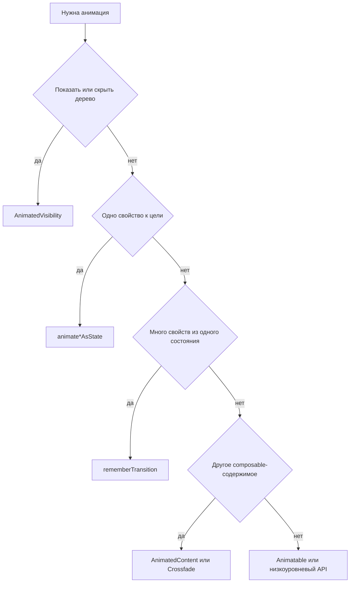

# Compose: анимации

## Главное правило

Выбирайте **самый малый API, подходящий задаче**: сначала встроенные переходы видимости и разметки, затем одно анимируемое значение, затем общий объект перехода для нескольких значений, и только потом жестовые или императивные API, если средствами фреймворка движение не описать.

## Порядок проверки

1. Определите зрительную задачу: показать или скрыть, изменить одно значение, согласованно изменить несколько значений, заменить содержимое, изменить размер или двигаться по жесту.
2. Выберите самый малый API из таблицы.
3. Проверьте жизненный цикл: скрытое содержимое должно уйти из композиции, сохранить фокус и состояние или лишь стать прозрачным?
4. Проверьте идентичность: у обёрток состояния выбирайте `AnimatedContent.contentKey` по виду содержимого, а не по каждой смене данных.
5. Проверьте скорость: значения анимации, меняющиеся каждый кадр, храните как `State` и по возможности читайте в блочных модификаторах размещения и рисования.
6. Переходите к `Animatable` и низкоуровневым API лишь когда движение к целевому состоянию не выражает задачу.

## Выберите самый малый API

| Задача | API |
|---|---|
| Показать или скрыть дерево с переходами входа и выхода; после выхода содержимое удаляется | [`AnimatedVisibility`](https://developer.android.com/develop/ui/compose/animation/composables-modifiers#animatedvisibility) |
| Двигать одно свойство к цели из состояния | [`animateFloatAsState`](https://developer.android.com/develop/ui/compose/animation/value-based#animate-as-state), `animateDpAsState`, `animateColorAsState`, `animateOffsetAsState` и другие |
| Несколько значений должны следовать одному Boolean, enum или sealed-состоянию | `rememberTransition` и дочерние анимации перехода: `animateFloat`, `animateDp`, `animateColor`, `animateValue` и другие |
| Плавно менять размер при изменении высоты или ширины ребёнка, например при переносе текста | `Modifier.animateContentSize()` |
| Заменять разные деревья composable-функций в одном месте | `AnimatedContent` или `Crossfade` |
| Движение от пользователя: перетаскивание, бросок, прерываемая пружина | [`Animatable`](https://developer.android.com/reference/kotlin/androidx/compose/animation/core/Animatable) и связанные API корутин |

## Появление и исчезновение

**Предпочитайте `AnimatedVisibility`**, когда интерфейс должен входить в дерево и выходить из него с переходом:

```kotlin
AnimatedVisibility(visible = expanded) {
    Text("Подробности…")
}
```

`animateFloatAsState` для прозрачности лишь делает элемент невидимым: composable-функция **остаётся в композиции** и продолжает участвовать в размещении, если вы сами не ограничили её показ. Такой вариант нужен, когда дочерние элементы должны сохранить состояние и фокус, но стать невидимыми. Для настоящего удаления из дерева берите `AnimatedVisibility` либо условную композицию по схемам `AnimatedVisibility` и `AnimatedContent` из [краткой справки](https://developer.android.com/develop/ui/compose/animation/quick-guide).

## Цвет фона

Для плавного перехода между цветами берите `animateColorAsState`.

Для анимируемой заливки за дочерними элементами [краткая справка](https://developer.android.com/develop/ui/compose/animation/quick-guide) рекомендует рисовать через **`Modifier.drawBehind`**, а не `Modifier.background()`: так цвет меняется в фазе рисования и меньше мешает производительности.

```kotlin
val background = animateColorAsState(
    targetValue = if (selected) selectedColor else idleColor,
    label = "background",
)
Box(
    Modifier.drawBehind { drawRect(background.value) },
) { /* Содержимое */ }
```

## Изменение размера

`Modifier.animateContentSize()` анимирует изменение размера разметки. Это удобно для раскрытия и сворачивания текста или меняющихся меток, без ручной анимации ширины и высоты.

## Анимации по значению (`animate*AsState`)

Compose даёт `animate*AsState` для `Float`, `Dp`, `Color`, `Size`, `Offset`, `Rect`, `Int`, `IntOffset`, `IntSize` и других типов. Вы задаёте **цель**, а API хранит состояние перехода.

- Если стандарт не подходит, передайте `AnimationSpec` через `animationSpec`, например `spring` или `tween`.
- Для отладки и инструментов задавайте разные **`label`**, если в одной composable-функции несколько анимаций.
- О завершении и последовательностях см. [анимации по значению](https://developer.android.com/develop/ui/compose/animation/value-based).

```kotlin
val width by animateDpAsState(
    targetValue = if (expanded) 200.dp else 56.dp,
    animationSpec = spring(dampingRatio = 0.7f, stiffness = Spring.StiffnessMedium),
    label = "fabWidth",
)
```

## Несколько свойств: `rememberTransition`

Когда одно состояние, например `enum class Phase { A, B, C }`, должно согласованно менять несколько значений, используйте `rememberTransition` и объявите дочерние анимации:

```kotlin
val transition = rememberTransition(targetState = phase, label = "phase")
val alpha by transition.animateFloat(label = "alpha") { target ->
    if (target == Phase.Visible) 1f else 0f
}
val offset by transition.animateDp(label = "offset") { target ->
    if (target == Phase.Visible) 0.dp else 24.dp
}
```

Не делайте несколько независимых вызовов `animate*AsState`, если значения должны оставаться синхронными: при разных целях или спецификациях они могут разойтись. В старом коде встречается `updateTransition`; для нового кода предпочитайте `rememberTransition`.

## Как выбрать API для замены содержимого

Если таблицы недостаточно, используйте официальное дерево [выбора API анимации](https://developer.android.com/develop/ui/compose/animation/choose-api):

| Ситуация | Что предпочесть |
|---|---|
| Та же composable-функция, меняются **целевые значения** свойств разметки | `animate*AsState` или `rememberTransition` |
| В одной области меняется **содержимое composable-функции**, например вкладка или шаг | `AnimatedContent` с `transitionSpec` и `contentKey` либо простой `Crossfade` |
| Свайп между страницами как в пейджере | API горизонтальных страниц из справки по анимации и Material; следуйте дереву выбора API |
| Переходы принадлежат Navigation Compose | Используйте встроенные переходы навигации, а не добавляйте `AnimatedContent` поверх той же замены маршрута |

Движение иллюстраций, Lottie и сложных временных шкал векторов выходит за рамки навыка; берите специальные библиотеки.

## Схема выбора



## Ключи `AnimatedContent` для владельцев состояния

Если `AnimatedContent` получает обёртку состояния, например `AsyncResult<T>`, `Result<T>` или sealed `UiState`, решите, что должно запускать переход. Обычно переход нужен при смене **формы содержимого** — загрузка → данные → ошибка, — а не при смене данных внутри одной формы.

Для этого используйте `contentKey`:

```kotlin
AnimatedContent(
    targetState = result,
    contentKey = { state ->
        when (state) {
            AsyncResult.Loading -> "loading"
            is AsyncResult.Success -> "content"
            is AsyncResult.Error -> "error"
        }
    },
    label = "profile-content",
) { state ->
    when (state) {
        AsyncResult.Loading -> Loading()
        is AsyncResult.Success -> Profile(state.value)
        is AsyncResult.Error -> ErrorMessage(state.throwable)
    }
}
```

Без `contentKey` каждый неравный `Success(value)` может считаться новым содержимым. Это полезно, если изменение данных должно запускать переход, но создаёт лишнее движение, когда свежие данные обновляют тот же вид экрана.

Выбирайте ключ по виду:

| Изменение состояния | Типичный `contentKey` |
|---|---|
| Загрузка → данные → ошибка | Ключ ветки: `"loading"`, `"content"`, `"error"` |
| Успешный элемент A → успешный элемент B должны плавно смениться | Постоянный ID элемента |
| Обновление данных успеха должно произойти на месте | Постоянный ключ для `Success` |
| Меняется текст ошибки, но вид ошибки тот же | Постоянный ключ для `Error` |

## Анимируемые значения и скорость композиции

`animate*AsState` возвращает `State`, который часто обновляется. Если значение передаётся в `Modifier.offset`, `Modifier.graphicsLayer`, размещение рядом с прокруткой или другой путь, работающий **каждый кадр**, не читайте его через `by` в теле composable-функции с последующей передачей в модификатор через значение. Используйте **отложенное чтение**: блочные модификаторы, лямбды рисования и размещения. См. [`compose-state-deferred-reads`](../compose-state-deferred-reads/SKILL.md).

Если во время движения растёт число рекомпозиций, а причина не в нестабильности данных, см. [`compose-recomposition-performance`](../compose-recomposition-performance/SKILL.md).

## Когда открыть дополнительную справку

| Задача | Начните с |
|---|---|
| Неясно, какой API выбрать | [Выбор API анимации](https://developer.android.com/develop/ui/compose/animation/choose-api) |
| Движение от жеста, прерывание или отмена | [`Animatable`](https://developer.android.com/reference/kotlin/androidx/compose/animation/core/Animatable), ввод указателя и затухание |
| Бесконечный или повторяющийся цикл | [`rememberInfiniteTransition`](https://developer.android.com/reference/kotlin/androidx/compose/animation/core/rememberInfiniteTransition) |
| Доступный для теста прогресс или перемотка | [`SeekableTransitionState`](https://developer.android.com/reference/kotlin/androidx/compose/animation/core/SeekableTransitionState) и связанные API |

## Частые ошибки

| Ошибка | Исправление |
|---|---|
| `animateFloatAsState(alpha)` делает прозрачным, но ожидается удаление дочерних элементов | `AnimatedVisibility` или удаление дерева из композиции при скрытии |
| Три `animateDpAsState` должны синхронно следовать одному enum | Один `rememberTransition` с дочерними анимациями |
| Цвет на `Modifier.background` создаёт лишнюю работу | По краткой справке предпочитайте `drawBehind { drawRect(animatedColor) }` |
| `LaunchedEffect` и ручной `Animatable` для простой анимации к цели | `animate*AsState` или `rememberTransition`, если жест не требует `Animatable` |
| Игнорируются собственные переходы Navigation | Используйте API навигации и не дублируйте ту же замену через `AnimatedContent` |
| `AnimatedContent(targetState = asyncResult)` анимирует каждое обновление данных | Добавьте `contentKey` по виду содержимого или постоянному ID элемента |

## Когда не применять

- Для времени побочных действий, `LaunchedEffect` и запуска работы по клику используйте [`compose-side-effects`](../compose-side-effects/SKILL.md).
- Для глубокого разбора места чтения snapshot-состояния используйте [`compose-state-deferred-reads`](../compose-state-deferred-reads/SKILL.md) как основной источник.
