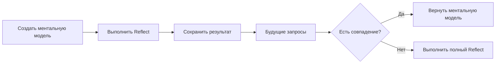

# Ментальные модели

Подготовленные пользователем сводки, которые содержат качественные готовые ответы на типовые вопросы.

{/* Импорт исходных файлов */}

## Что такое ментальные модели?

Ментальные модели — это **сохранённые ответы reflect**, которые пользователь подбирает для своего банка памяти. При создании модели Hindsight запускает операцию reflect с исходным запросом и сохраняет результат. При следующих вызовах reflect сначала проверяются эти заранее подготовленные сводки, благодаря чему ответы быстрее и последовательнее.



### Зачем нужны ментальные модели?

| Преимущество | Описание |
|--------------|----------|
| **Последовательность** | На типовые вопросы каждый раз даётся один и тот же ответ. |
| **Скорость** | Готовые ответы возвращаются сразу. |
| **Качество** | Сводки подготовлены вручную и проверены. |
| **Контроль** | Можно точно задать способ ответа на важные темы. |

### Иерархия поиска

Во время reflect агент проверяет источники в порядке приоритета:

1. **Ментальные модели** — сводки, подобранные пользователем (высший приоритет).
2. **Наблюдения** — консолидированные знания.
3. **Исходные факты** — воспоминания, содержащие первичные сведения.

Ментальные модели проверяются первыми, потому что это знания, отобранные пользователем.

---

## Создание ментальной модели

Модель создаётся в фоновом режиме: запускается reflect и сохраняется результат.

### Python

```python
# Создаёт ментальную модель; reflect выполняется в фоне
result = client.create_mental_model(
    bank_id=BANK_ID,
    name="Team Communication Preferences",
    source_query="How does the team prefer to communicate?",
    tags=["team", "communication"]
)

# Возвращает operation_id; проверьте завершение через конечную точку операций
print(f"Operation ID: {result.operation_id}")
```

### Node.js

```javascript
// Создаёт ментальную модель; reflect выполняется в фоне
const result = await client.createMentalModel(
    BANK_ID,
    'Team Communication Preferences',
    'How does the team prefer to communicate?',
    { tags: ['team', 'communication'] },
);

// Возвращает operation_id; проверьте завершение через конечную точку операций
console.log(`Operation ID: ${result.operation_id}`);
```

### CLI

```bash
# Создаёт ментальную модель; reflect выполняется в фоне
hindsight mental-model create "$BANK_ID" \
  "Team Communication Preferences" \
  "How does the team prefer to communicate?"
```

### Go

```go
# Section 'create-mental-model' not found in api/mental-models.go
```

### Параметры

| Параметр | Тип | Обязательный | Описание |
|----------|-----|--------------|----------|
| `name` | string | Да | Понятное человеку название модели. |
| `source_query` | string | Да | Запрос, который выполняется для создания содержимого. |
| `id` | string | Нет | Пользовательский идентификатор модели: строчные латинские буквы, цифры и дефисы. Если не указан, создаётся автоматически. |
| `tags` | list | Нет | Метки задают область модели при reflect **и** фильтруют исходные воспоминания при обновлении. По умолчанию используется строгое совпадение `all_strict`: учитываются только воспоминания со всеми указанными метками. См. [метки и видимость](#метки-и-видимость). |
| `max_tokens` | int | Нет | Максимальное количество токенов в содержимом модели. |
| `trigger` | object | Нет | Параметры запуска обновления (см. [автоматическое обновление](#автоматическое-обновление)). |

---

## Создание с пользовательским идентификатором

Задайте модели постоянный понятный идентификатор, чтобы находить и изменять её по имени, а не по автоматически сгенерированному UUID.

### Python

```python
# Создаёт ментальную модель с заданным идентификатором
result_with_id = client.create_mental_model(
    bank_id=BANK_ID,
    name="Communication Policy",
    source_query="What are the team's communication guidelines?",
    id="communication-policy"
)

print(f"Created with custom ID: {result_with_id.operation_id}")
```

### Node.js

```javascript
// Создаёт ментальную модель с заданным идентификатором
const resultWithId = await client.createMentalModel(
    BANK_ID,
    'Communication Policy',
    "What are the team's communication guidelines?",
    { id: 'communication-policy' },
);

console.log(`Created with custom ID: ${resultWithId.operation_id}`);
```

### CLI

```bash
# Создаёт ментальную модель с заданным идентификатором
hindsight mental-model create "$BANK_ID" \
  "Communication Policy" \
  "What are the team's communication guidelines?" \
  --id communication-policy
```

### Go

```go
# Section 'create-mental-model-with-id' not found in api/mental-models.go
```

> **💡 Совет**
>
> Пользовательский идентификатор должен состоять из строчных латинских букв и цифр; можно использовать дефисы, например `team-policies`, `q4-status`. Если такой идентификатор уже существует, запрос отклоняется.

---

## Автоматическое обновление

Настройте **автоматическое обновление** ментальных моделей при изменении наблюдений. Тогда они будут учитывать актуальные знания без ручного запуска.

### Параметры запуска

| Параметр | Тип | По умолчанию | Описание |
|----------|-----|--------------|----------|
| `mode` | `"full"` \| `"delta"` | `"full"` | Способ обновления. См. [режим обновления](#режим-обновления). |
| `refresh_after_consolidation` | bool | false | Автоматически обновлять модель после консолидации наблюдений. |
| `refresh_cron` | string \| null | null | Пятикомпонентное cron-выражение в UTC для обновлений по расписанию, например `"0 3 * * *"` — каждый день в 03:00 UTC. |

Если включён `refresh_after_consolidation`, модель заново создаётся после каждой консолидации наблюдений банка, поэтому всегда отражает актуальные обобщённые знания.

Если задан `refresh_cron`, Hindsight проверяет расписание в момент обновления ментальных моделей на сервере и обновляет модель, только если относящиеся к ней воспоминания изменились со времени предыдущего обновления. Параметры `refresh_cron` и `refresh_after_consolidation` нельзя использовать вместе: модель обновляется либо после консолидации, либо по расписанию в UTC.

### Режим обновления

Для создания нового содержимого доступны две стратегии:

- **`full`** *(по умолчанию)* — при каждом обновлении всё содержимое создаётся заново. Простой и предсказуемый вариант: LLM формирует новый документ по найденным воспоминаниям. Подходит для коротких документов, если результат может менять структуру при каждом обновлении или пока неизвестен окончательный формат.
- **`delta`** — при обновлении создаётся список типизированных *операций* над имеющейся структурой документа (добавить раздел, добавить пункт, заменить блок, удалить устаревший абзац), после чего собирается результат. Разделы, не затронутые операциями, копируются **побайтно**, без перефразирования, изменения пробелов и нормализации списков. Подходит для долгоживущих руководств и планов действий, где нужна стабильная структура и должны меняться только действительно устаревшие части.

В двух случаях режим delta автоматически переключается на полную генерацию:

1. У модели ещё нет содержимого, на котором можно основать изменения.
2. После последнего обновления изменился `source_query`: тема сдвинулась, и прежняя структура может уже не подходить.

Если запрос к LLM завершится ошибкой или вернёт пустой ответ, имеющееся содержимое сохранится: обновление никогда не заменяет заполненный документ пустым.

| Сценарий | Рекомендуемый режим | Причина |
|----------|---------------------|---------|
| Документация навыка или план действий | `delta` | Разделы сохраняются надолго; меняются только отдельные правила. |
| Сводки для адаптации новых сотрудников | `delta` | Появление новых членов команды не должно менять структуру документа. |
| Панели текущих показателей | `full` | Каждое обновление создаёт новый снимок состояния. |
| Краткие ответы на частые вопросы | `full` | Пересоздать небольшой документ просто и однозначно. |

### Python

```python
# Создаёт ментальную модель с автоматическим обновлением
result = client.create_mental_model(
    bank_id=BANK_ID,
    name="Project Status",
    source_query="What is the current project status?",
    trigger={"refresh_cron": "0 3 * * *"}
)

# Проверяет каждый день в 03:00 UTC и обновляет модель, если изменились подходящие воспоминания
print(f"Operation ID: {result.operation_id}")
```

### Node.js

```javascript
// Создаёт ментальную модель с автоматическим обновлением
const result2 = await client.createMentalModel(
    BANK_ID,
    'Project Status',
    'What is the current project status?',
    { trigger: { refreshCron: '0 3 * * *' } },
);

// Проверяет каждый день в 03:00 UTC и обновляет модель, если изменились подходящие воспоминания
console.log(`Operation ID: ${result2.operation_id}`);
```

### CLI

```bash
# Создаёт ментальную модель и возвращает её идентификатор для дальнейших операций
hindsight mental-model create "$BANK_ID" \
  "Project Status" \
  "What is the current project status?"
```

### Go

```go
# Section 'create-mental-model-with-trigger' not found in api/mental-models.go
```

### Когда включать автоматическое обновление

| Сценарий | Автоматическое обновление | Причина |
|----------|--------------------------|---------|
| **Панели текущих показателей** | ✅ Включить | Состояние должно быть актуальным. |
| **Сводки правил** | ❌ Отключить | Правила меняются редко; предпочтительно ручное обновление. |
| **Предпочтения пользователей** | ✅ Включить | Они меняются при новых взаимодействиях. |
| **Ответы на частые вопросы** | ❌ Отключить | Ответы отобраны вручную; перед обновлением нужна проверка. |

> **💡 Совет**
>
> Включайте автоматическое обновление для моделей, которые должны оставаться актуальными. Отключайте его для отобранного вручную содержимого, которое нужно проверить до публикации изменений.

---

## Список ментальных моделей

### Python

```python
# Выводит все ментальные модели в банке
mental_models = client.list_mental_models(bank_id=BANK_ID)

for mental_model in mental_models.items:
    print(f"- {mental_model.name}: {mental_model.source_query}")
```

### Node.js

```javascript
// Выводит все ментальные модели в банке
const mentalModels = await client.listMentalModels(BANK_ID);

for (const mm of mentalModels.items) {
    console.log(`- ${mm.name}: ${mm.source_query}`);
}
```

### CLI

```bash
# Выводит все ментальные модели в банке
hindsight mental-model list "$BANK_ID"
```

### Go

```go
# Section 'list-mental-models' not found in api/mental-models.go
```

---

## Получение ментальной модели

### Python

```python
# Section 'get-mental-model' not found in api/mental-models.py
```

### Node.js

```javascript
// Получает указанную ментальную модель
const mentalModel = await client.getMentalModel(BANK_ID, mentalModelId);

console.log(`Name: ${mentalModel.name}`);
console.log(`Content: ${mentalModel.content}`);
console.log(`Last refreshed: ${mentalModel.last_refreshed_at}`);
```

### CLI

```bash
# Section 'get-mental-model' not found in api/mental-models.sh
```

### Go

```go
# Section 'get-mental-model' not found in api/mental-models.go
```

### Уровни подробности

Для конечных точек списка и получения можно передать необязательный параметр запроса `detail`, который задаёт объём ответа. Это помогает сократить размер данных, особенно при инициализации агента или работе клиентов MCP с ограниченным контекстом.

| Уровень | Возвращаемые поля | Сценарий |
|---------|-------------------|----------|
| `metadata` | `id`, `bank_id`, `name`, `tags`, `last_refreshed_at`, `created_at` | Список: «Какие модели существуют?» |
| `content` | Все поля metadata, а также `source_query`, `content`, `max_tokens`, `trigger` | Запуск агента: «Что сообщают модели?» |
| `full` (по умолчанию) | Все поля, включая `reflect_response` | Подробная проверка: «Какие свидетельства подтверждают модель?» |

```bash
# Получить только названия и метки (минимальный ответ)
curl "$BASE_URL/v1/default/banks/$BANK_ID/mental-models?detail=metadata"

# Получить содержимое без цепочек происхождения данных
curl "$BASE_URL/v1/default/banks/$BANK_ID/mental-models?detail=content"

# Получить все подробности (поведение по умолчанию)
curl "$BASE_URL/v1/default/banks/$BANK_ID/mental-models/$MODEL_ID?detail=full"
```

Параметр `detail` также доступен в инструментах MCP:

```json
{"bank_id": "my-bank", "detail": "metadata"}
```

> **💡 Совет**
>
> Используйте `detail=content` при подготовке агента к работе. Ответ содержит всё необходимое для понимания моделей, но не включает объёмные цепочки происхождения `reflect_response`: в банках с большим числом моделей они могут превышать 200 КБ.

### Поля ответа

| Поле | Тип | Уровень подробности | Описание |
|------|-----|---------------------|----------|
| `id` | string | metadata | Уникальный идентификатор ментальной модели. |
| `bank_id` | string | metadata | Идентификатор банка памяти. |
| `name` | string | metadata | Понятное человеку название. |
| `tags` | list | metadata | Метки для фильтрации. |
| `last_refreshed_at` | string | metadata | Время последнего обновления модели. |
| `created_at` | string | metadata | Время создания модели. |
| `source_query` | string | content | Запрос, по которому сформировано содержимое. |
| `content` | string | content | Сгенерированный текст ментальной модели. |
| `max_tokens` | int | content | Максимальное количество токенов для содержимого модели. |
| `trigger` | object | content | Параметры запуска; см. [автоматическое обновление](#автоматическое-обновление). |
| `reflect_response` | object | full | Полный ответ reflect, включая факты происхождения `based_on`. |

---

## Обновление ментальной модели

Повторно выполните исходный запрос, чтобы обновить модель с учётом текущих знаний.

### Python

```python
# Section 'refresh-mental-model' not found in api/mental-models.py
```

### Node.js

```javascript
// Обновляет ментальную модель на основе актуальных знаний
const refreshResult = await client.refreshMentalModel(BANK_ID, mentalModelId);

console.log(`Refresh operation ID: ${refreshResult.operation_id}`);
```

### CLI

```bash
# Section 'refresh-mental-model' not found in api/mental-models.sh
```

### Go

```go
# Section 'refresh-mental-model' not found in api/mental-models.go
```

Обновление полезно, если:

- сохранены новые воспоминания по этой теме;
- изменились наблюдения;
- нужно убедиться, что модель отражает актуальные знания.

---

## Очистка ментальной модели

Удалите содержимое модели, чтобы следующее обновление выполнило **полный пересинтез с нуля**, независимо от режима запуска.

Это полезно для моделей с режимом delta, которые накопили отклонения после множества постепенных обновлений. Со временем могут накапливаться неточности: при каждом обновлении delta модель видит только новые факты со времени предыдущего. Очистка с последующим обновлением создаёт новую основу из всех фактов.

### Python

```python
# Section 'clear-mental-model' not found in api/mental-models.py
```

### Node.js

```javascript
// Очищает содержимое модели, затем обновляет его с полным пересинтезом
await client.clearMentalModel(BANK_ID, mentalModelId);

// Запускает новую полную генерацию
const fullRefreshResult = await client.refreshMentalModel(BANK_ID, mentalModelId);

console.log(`Full refresh operation ID: ${fullRefreshResult.operation_id}`);
```

### CLI

```bash
# Section 'clear-mental-model' not found in api/mental-models.sh
```

### Go

```go
# Section 'clear-mental-model' not found in api/mental-models.go
```

Операция очистки выполняется синхронно и заменяет содержимое пустой строкой. Настройки модели (имя, исходный запрос и параметры запуска) сохраняются. Поскольку содержимое теперь пусто, следующий вызов `/refresh` всегда создаст его заново полностью, даже если режим запуска модели — `delta`.

> **💡 Совет**
>
> Для долгоживущих моделей delta рассмотрите периодическую очистку с обновлением, например каждые 48 часов. Так содержимое будет оставаться точным, а между полными пересозданиями можно будет пользоваться постепенными обновлениями.

---

## Изменение ментальной модели

Измените название модели:

### Python

```python
# Section 'update-mental-model' not found in api/mental-models.py
```

### Node.js

```javascript
// Обновляет метаданные ментальной модели
const updated = await client.updateMentalModel(BANK_ID, mentalModelId, {
    name: 'Updated Team Communication Preferences',
    trigger: { refresh_after_consolidation: true },
});

console.log(`Updated name: ${updated.name}`);
```

### CLI

```bash
# Section 'update-mental-model' not found in api/mental-models.sh
```

### Go

```go
# Section 'update-mental-model' not found in api/mental-models.go
```

---

## Удаление ментальной модели

### Python

```python
# Section 'delete-mental-model' not found in api/mental-models.py
```

### Node.js

```javascript
// Удаляет ментальную модель
await client.deleteMentalModel(BANK_ID, mentalModelId);
```

### CLI

```bash
# Section 'delete-mental-model' not found in api/mental-models.sh
```

### Go

```go
# Section 'delete-mental-model' not found in api/mental-models.go
```

---

## Метки и видимость

Для ментальных моделей действует та же система меток, что и для воспоминаний. Метки модели определяют **какие воспоминания она читает** при обновлении и **когда появляется** при reflect.

### Как метки влияют на обновление ментальной модели

> **⚠️ Внимание**
>
> Метки сужают список исходных воспоминаний, доступных при обновлении модели. Если подходящих воспоминаний ещё нет, обновление вернёт пустое содержимое (например, `"I cannot find any information…"`), даже если прямой вызов `reflect` с тем же запросом работает. Сначала добавьте метки к нужным воспоминаниям или переопределите режим по умолчанию параметрами `trigger.tags_match` / `trigger.tag_groups`.

При ручном или автоматическом обновлении ментальной модели внутренне запускается reflect для пересоздания содержимого. Если у модели есть метки, запрос использует строгое соответствие `all_strict`: учитываются только воспоминания, у которых есть **все** метки модели. Воспоминания без меток исключаются.

```
Метки модели: ["user:alice"]

При обновлении учитываются:
  ✅ "Alice prefers async communication"     — есть метка "user:alice"
  ✅ "Team uses Slack for announcements"      — есть метка "user:alice" и другие
  ❌ "Company policy: no meetings on Fridays" — меток нет, поэтому исключено
  ❌ "Bob dislikes long meetings"             — нет метки "user:alice"
```

Таким образом, модель с меткой `["user:alice"]` также получит воспоминания с метками `["user:alice", "team"]`: дополнительные метки не исключают воспоминание. Обязательны только метки самой модели.

### Как метки влияют на поиск модели во время reflect

Если вызвать `reflect` с метками, они же определят, какие ментальные модели агент сможет увидеть. Модель видна только в том случае, если её метки пересекаются с метками запроса reflect.

Подробности о режимах соответствия меток (`any`, `any_strict`, `all`, `all_strict`) и примеры приведены в [справочнике меток Recall](./recall#tags).

### Просмотр меток ментальных моделей

Параметр запроса `source` для `GET /v1/default/banks/{bank_id}/tags` задаёт, из какого набора брать метки:

- `source=memories` *(по умолчанию)* — метки единиц памяти.
- `source=mental_models` — метки ментальных моделей этого банка.

Используйте `source=mental_models`, чтобы настроить автодополнение или фильтрацию по меткам моделей отдельно от списка меток воспоминаний, который обычно больше.

---

## История

При каждом изменении содержимого модели — через обновление или вручную — сохраняется предыдущая версия с отметкой времени. Полный журнал доступен через конечную точку истории.

### Python

```python
# Section 'get-mental-model-history' not found in api/mental-models.py
```

### Node.js

```javascript
// Получает историю изменений ментальной модели
const history = await client.getMentalModelHistory(BANK_ID, mentalModelId);

for (const entry of history) {
    console.log(`Changed at: ${entry.changed_at}`);
    console.log(`Previous content: ${entry.previous_content}`);
}
```

### CLI

```bash
# Section 'get-mental-model-history' not found in api/mental-models.sh
```

### Go

```go
# Section 'get-mental-model-history' not found in api/mental-models.go
```

### Ответ

Конечная точка возвращает список записей истории, начиная с самой новой:

| Поле | Тип | Описание |
|------|-----|----------|
| `previous_content` | string \| null | Содержимое до изменения (`null`, если оно недоступно). |
| `changed_at` | string | Время изменения в формате ISO 8601. |

В каждой записи сохранены **содержимое до изменения** и время изменения. Текущее содержимое возвращает стандартная конечная точка [получения ментальной модели](#получение-ментальной-модели).

> **📝 Примечание**
>
> Отслеживание истории включено по умолчанию. Чтобы выключить его, задайте `HINDSIGHT_API_ENABLE_MENTAL_MODEL_HISTORY=false`.

---

## Примеры применения

| Сценарий | Пример |
|----------|--------|
| **Ответы на частые вопросы** | Заранее подготовить ответы на распространённые вопросы клиентов. |
| **Сводки для новых сотрудников** | «Что нужно знать новым членам команды?» |
| **Отчёты о состоянии** | «Каково текущее состояние проекта?» с еженедельным обновлением. |
| **Сводки правил** | «Какие у нас правила безопасности?» |

---

## Дальше

- [**Reflect**](./reflect) — как агент использует ментальные модели в цикле рассуждений.
- [**Наблюдения**](../observations.md) — как консолидируются знания.
- [**Операции**](./operations) — отслеживание фонового создания ментальных моделей.
