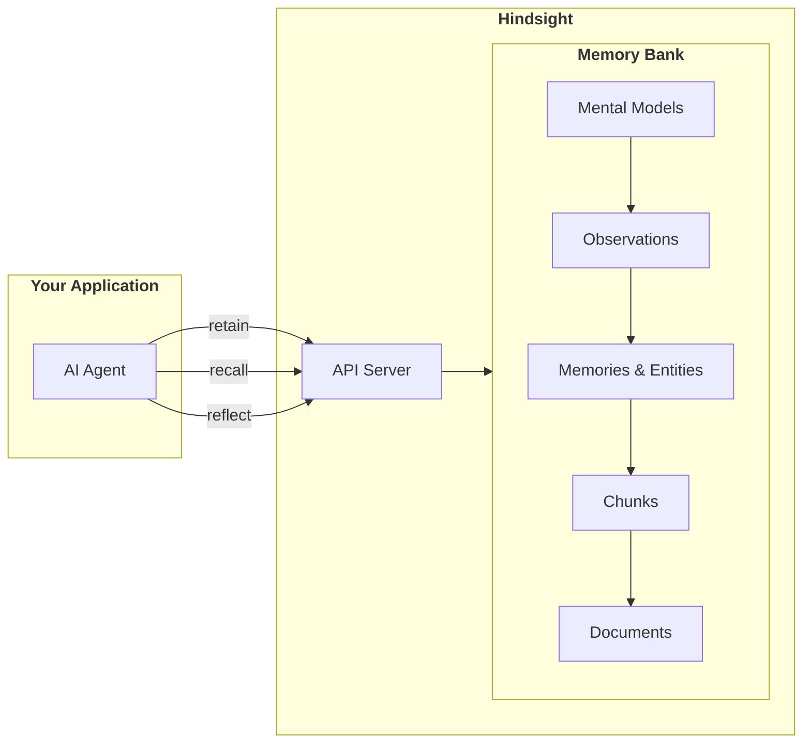
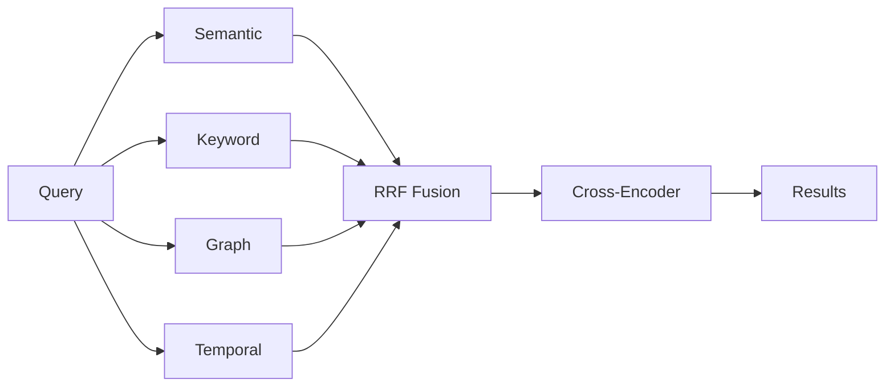

# Обзор

## Зачем нужен Hindsight?

ИИ-агенты забывают всё между сеансами. Каждый разговор начинается с нуля: без сведений о пользователе, прошлых беседах и выводах помощника. Это сильно сужает задачи, которые ИИ-агент может решать.

**Задача сложнее, чем кажется:**

- **Одного поиска по векторам мало** — вопрос «Чем Алиса занималась прошлой весной?» требует учитывать время, а не только сходство по смыслу.
- **Факты остаются разрозненными** — факты «Алиса работает в Google» и «Google находится в Маунтин-Вью» должны помочь ответить на вопрос «Где работает Алиса?», даже если готовый ответ не сохраняли.
- **ИИ-агентам нужно обобщать знания** — помощник для кода должен обобщить факт «пользователь предпочитает функциональный стиль» в наблюдение и учитывать его в советах.
- **Нужен контекст** — одни и те же сведения имеют разный смысл для банков памяти с разными чертами поведения.

Hindsight решает эти задачи с помощью памяти, созданной для ИИ-агентов.

## Что делает Hindsight

**Ваш ИИ-агент** сохраняет сведения через `retain()`, ищет их через `recall()` и рассуждает через `reflect()`. Все операции идут в его собственном **банке памяти**.

## Главные части

### Виды памяти

Hindsight раскладывает знания по уровням — от отдельных фактов до обобщений:

| Вид | Что хранит | Пример |
|------|----------------|---------|
| **Ментальная модель** | Созданные пользователем сводки для частых запросов | «Как лучше общаться в команде» |
| **Наблюдение** | Знания, которые система сама обобщила из фактов | «Раньше пользователь любил React, а теперь перешёл на Vue» (сохраняет историю) |
| **Факт о мире** | Полученные факты о внешнем мире | «Алиса работает в Google» |
| **Факт из опыта** | Действия и беседы самого банка | «Я посоветовал Бобу Python» |

При reflect агент проверяет источники в таком порядке: **ментальные модели → наблюдения → исходные факты**.

### Поиск несколькими способами (TEMPR)

Четыре вида поиска работают параллельно:

| Способ | Когда полезен |
|----------|----------|
| **По смыслу** | Сходные понятия и пересказ своими словами |
| **По ключевым словам (BM25)** | Имена, технические термины и точные совпадения |
| **По графу** | Связанные сущности и косвенные связи |
| **По времени** | «Прошлой весной», «в июне», диапазоны дат |

### Обобщение наблюдений

После сохранения воспоминаний Hindsight сам объединяет связанные факты в **наблюдения** — выводы, основанные на фактах из разных воспоминаний и очищенные от повторов:

- **Удаление повторов**: совпадающие факты соединяются в одно устойчивое наблюдение.
- **Связь с источником**: каждое наблюдение ссылается на исходные воспоминания с точными цитатами и хранит число подтверждений.
- **Постоянное уточнение**: новые факты могут поддержать, опровергнуть или дополнить наблюдение; оно обновляется с сохранением истории, а не перезаписывается без следа.
- **Учёт свежих данных**: если новые воспоминания ещё не попали в обобщение, `reflect` считает затронутые наблюдения устаревшими и сверяет их с исходными фактами.

### Задача, указания и черты поведения

Настройки банка памяти влияют на рассуждение агента при `reflect`:

| Настройка | Назначение | Пример |
|---------------|---------|---------|
| **Задача (mission)** | Описывает роль банка обычным языком | «Я помогаю с исследованиями в ML. Предпочитаю простые методы новым, но сложным» |
| **Указания (directives)** | Жёсткие правила, которые агент обязан соблюдать | «Никогда не советуй отдельные акции», «Всегда ссылайся на источники» |
| **Черты поведения (disposition)** | Мягко влияют на стиль рассуждения | Скептицизм, буквальность, эмпатия (шкала 1–5) |

**Задача** подсказывает Hindsight, какие знания важнее, и даёт контекст для рассуждения. **Указания** ставят строгие границы. **Черты поведения** влияют на трактовку ответа.

Эти настройки влияют лишь на `reflect`, но не на `recall`.

## Клиенты и языки

<ClientsGrid />

## Подключения

Все поддерживаемые подключения перечислены в разделе Integrations Hub.

## Что дальше

### Первые шаги
- [**Быстрый старт**](api/quickstart.md) — установка и запуск за 60 секунд
- [**RAG и Hindsight**](rag-vs-hindsight.md) — различия на примерах

### Основные понятия
- [**Retain**](retain.md) — хранение воспоминаний в виде многомерных фактов
- [**Recall**](retrieval.md) — поиск памяти четырьмя способами через TEMPR
- [**Reflect**](reflect.md) — как задача, указания и черты поведения влияют на вывод

### Методы API
- [**Retain**](api/retain.md) — запись сведений в банки памяти
- [**Recall**](api/recall.md) — поиск воспоминаний
- [**Reflect**](api/reflect.md) — рассуждение агента с опорой на память
- [**Ментальные модели**](api/mental-models.md) — созданные пользователем сводки для частых запросов
- [**Банки памяти**](api/memory-banks.md) — настройка задачи, указаний и черт поведения
- [**Документы**](api/documents.md) — работа с источниками документов
- [**Операции**](api/operations.md) — слежение за асинхронными задачами

### Развёртывание
- [**Запуск сервера**](installation.md) — Docker Compose, Helm или pip
