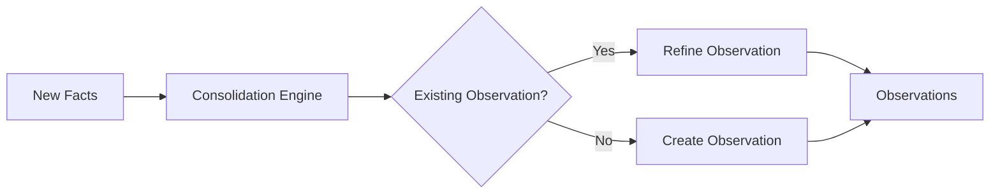

# Наблюдения: обобщение знаний

После сохранения воспоминаний Hindsight сам объединяет связанные факты в **наблюдения** — выводы банка из разных воспоминаний, без повторов и с опорой на доказательства. У каждого наблюдения есть ссылки на исходные записи (с точными цитатами) и число подтверждений. Новые сведения уточняют наблюдение, а не просто заменяют его.



---

## Что такое наблюдения?

Наблюдения — **обобщённые знания** из нескольких фактов. Исходный факт хранит отдельное сведение, а наблюдение — вывод, предпочтение или урок, подкреплённый накопленными данными и очищенный от повторов. Это не сводка, которую LLM придумала на ходу: у каждого наблюдения есть точные исходные воспоминания и число подтверждений. Новые сведения могут поддержать, опровергнуть или дополнить его.

| Исходные факты | Наблюдение |
|-----------|--------------|
| «Алиса предпочитает Python» | «Алиса пишет в основном на Python и ценит ясность и простоту кода» |
| «Алиса не любит многословный код» | |
| «Алиса советует аннотации типов» | |

Наблюдения дают:
- **Меньше повторов**: один устойчивый вывод вместо многих близких фактов.
- **Связь с источником**: каждое наблюдение ссылается на воспоминания и цитаты, которые его подтверждают.
- **Развитие**: наблюдение уточняется, когда новые данные усиливают, ослабляют или опровергают его; история остаётся.
- **Учёт свежести**: если новые воспоминания ещё не обобщены, `reflect` считает затронутые наблюдения устаревшими и сверяет их с исходными фактами.
- **Быстрый поиск**: знания собраны в кратком виде.

---

## Как работает обобщение

### Автоматическая фоновая обработка

После завершения `retain()` движок обобщения запускается сам:

1. **Разбор новых фактов** — каждый новый факт сравнивается с прежними наблюдениями.
2. **Поиск закономерностей** — связанные факты группируются и обобщаются.
3. **Создание или правка наблюдений** — создаются новые или уточняются прежние.
4. **Учёт оснований** — для каждого наблюдения хранятся ссылки на подтверждающие факты.

### Слияние почти одинаковых наблюдений

При обобщении всё же могут появиться два наблюдения об одном и том же, записанные разными словами. Например, слабая модель создаст новый вывод вместо правки прежнего. Или новая формулировка одного наблюдения станет похожа на другое. Такие повторы мешают recall.

Если эта функция включена, Hindsight сам их разбирает. При каждом создании **или** обновлении наблюдение сравнивается с самыми похожими прежними. Если сходство велико, отдельная проверка решает, **слить** их в один вывод вместе с подтверждающими данными или **оставить** раздельно. Проверка читает полный текст обоих, поэтому значимые отличия — число, отрицание, имя сущности или язык — не теряются при слиянии.

Порог задаётся через [`HINDSIGHT_API_CONSOLIDATION_DEDUP_THRESHOLD`](configuration.md#observations): это нижняя граница косинусного сходства для сверки пары. Функция **включена по умолчанию** (`0.97`). Меньшее значение даёт более частое слияние; `1.0` выключает его. Слияние работает только с PostgreSQL: на Oracle оно пропускается при любом пороге.

Сравниваются лишь наблюдения **в одной области тегов**. Если каждому вызову retain дать свой тег, например `session-id`, у каждого сеанса будет своя область. Тогда почти одинаковые наблюдения разных сеансов никогда не сольются. Чтобы обобщать такие данные вместе, укажите при retain [`observation_scopes: "shared"`](api/retain.md#shared). Наблюдения попадут в одну общую область без тегов, а тег сеанса останется у исходных фактов для фильтра recall.

### Отключение автоматического обобщения

Задайте `HINDSIGHT_API_ENABLE_AUTO_CONSOLIDATION=false` (или настройте отдельный банк через [API настройки банка](api/memory-banks.md#observations-configuration)), чтобы обобщение не запускалось само после retain, удаления и правки. Тогда оно запустится лишь после явного вызова [адреса consolidate](#trigger-consolidation).

Это полезно, если нужно самим выбрать время обобщения: например, сперва записать большой пакет данных либо обобщать только часть областей.

### Обобщение выбранных областей

По умолчанию обобщение берёт **все** ещё не обработанные воспоминания банка. Параметр `observation_scopes` в запросе consolidate сужает их до нужных наборов тегов:

```python
# Consolidate only memories tagged with user:alice
client.consolidate(
    bank_id="my-bank",
    observation_scopes=[["user:alice"]]
)

# Consolidate memories for alice OR the engineering team
client.consolidate(
    bank_id="my-bank",
    observation_scopes=[["user:alice"], ["team:engineering"]]
)
```

Каждая область — список тегов. Воспоминание входит в неё, если его теги **содержат все** теги области. Например, области `["user:alice"]` подходит воспоминание с тегами `["user:alice", "team:eng"]`.

Если `observation_scopes` не задан, берутся все ещё не обобщённые воспоминания (как и в прежних версиях).

### Развитие на основе данных

Наблюдения меняются по мере появления новых данных:

| Событие | Что узнаёт банк | Состояние наблюдения |
|-------|---------------------|----------------|
| **День 1** | «Redis открыт по лицензии BSD» | «Redis хорош для кеша: он быстр, надёжен и подходит открытым проектам» (два подтверждения) |
| **День 2** | «У Redis сильное сообщество» | Наблюдение окрепло (три подтверждения) |
| **День 30** | «Redis сменил лицензию на SSPL» | Наблюдение уточнено: «Redis технически силён, но его лицензия вызывает вопросы при работе в облаке» |
| **День 45** | «Valkey отделился от Redis под лицензией BSD» | Новое наблюдение: «Для новых проектов, где нужен открытый код, стоит рассмотреть Valkey» |

### Работа с противоречиями

Что происходит, если новый факт противоречит прежнему наблюдению?

Движок не стирает старый вывод вслепую, а **согласует** противоречие и сохраняет историю перемен.

**Пример: изменились предпочтения пользователя**

| Время | Факт | Наблюдение |
|------|------|--------------|
| Неделя 1 | «Пользователь говорит, что любит React» | «Пользователь предпочитает React для интерфейса» |
| Неделя 2 | «Пользователь хвалит модель компонентов React» | «Пользователю нравится React, особенно его модель компонентов» |
| Неделя 3 | «Пользователь перешёл на Vue и больше не будет брать React» | «Раньше пользователь любил React и его модель компонентов, но теперь перешёл на Vue и больше не берёт React» |

Последнее наблюдение хранит **всю историю**, а не лишь факт «пользователь предпочитает Vue». Благодаря этому агент:

- Не посоветует уроки React тому, кто явно отказался от него.
- Поймёт *почему* смена важна: прежде React нравился пользователю, значит выбор был осознанным.
- Сможет при нужде напомнить историю: «Помню, раньше вы работали с React…».

Система:
1. **Находит конфликт** — новый факт спорит с прежним наблюдением.
2. **Хранит историю** — включает старое понимание в новый вывод.
3. **Создаёт более точное наблюдение** — описывает перемену с её нюансами.
4. **Обновляет свежесть** — отмечает, что наблюдение недавно менялось.

**Пример: исправление неверных сведений**

| Время | Факт | Наблюдение |
|------|------|--------------|
| День 1 | «Алиса работает в Google» | «Алиса — работник Google» |
| День 10 | «На самом деле Алиса работает в Meta, а не в Google» | «Алиса работает в Meta (раньше считали, что в Google)» |

Если новый факт явно исправляет прежний, наблюдение меняется с отметкой о старом понимании. Исходные факты всегда остаются, поэтому можно проследить, что было сказано и когда это исправили.

---

## Наблюдения в поиске

Наблюдения сами участвуют в `recall()` и `reflect()`.

### В Recall

Они возвращаются вместе с исходными фактами; параметр `types` позволяет их отобрать:

```python
# Include observations in recall
results = client.recall(
    bank_id="my-bank",
    query="What programming languages does Alice prefer?",
    types=["world", "experience", "observation"]
)

# Observations only
observations = client.recall(
    bank_id="my-bank",
    query="What patterns have I learned?",
    types=["observation"]
)
```

### В Reflect

Агент reflect ищет по уровням:

1. **[Ментальные модели](api/mental-models.md)** — сводки, созданные пользователем (главный приоритет).
2. **Наблюдения** — обобщённые знания с учётом свежести.
3. **Исходные факты** — основа для проверки.

Агент сам ищет наблюдения и учитывает их при рассуждении.

---

## Учёт свежести

У каждого наблюдения есть время последней правки. При reflect агент учитывает его:

- **Свежие наблюдения**: сразу берёт для вывода.
- **Устаревшие наблюдения**: сверяет с новыми фактами до использования.

Так ответы остаются верными при смене исходных данных.

---

## Области наблюдений

По умолчанию область наблюдения включает все теги воспоминания вместе. Параметр retain `observation_scopes` позволяет задать иной порядок: по одному наблюдению на тег, на каждое сочетание тегов или на свой список областей. Это важно, если у одного воспоминания несколько тегов, а для каждого нужна своя цепь наблюдений.

Полное описание — в разделе [`observation_scopes` API Retain](./api/retain#observation_scopes).

Чтобы увидеть области банка, вызовите `GET /v1/default/banks/{bank_id}/observations/scopes`. Ответ перечислит каждый точный набор тегов и число наблюдений в нём; пустой список тегов значит общую область. Если нужно получить именно эту область без наблюдений с лишними тегами, передайте найденный набор как `tags` с `tags_match: "exact"`. Для поиска **только** в общей области — наблюдений без тегов из `observation_scopes: "shared"` — передайте пустой список с точным совпадением: `tags: []`, `tags_match: "exact"`.

---

## Задача для наблюдений

Через **задачу наблюдений** (`observations_mission`) вы можете точно указать, что должен обобщать банк. Она заменяет встроенные правила устойчивых знаний вашими указаниями и задаёт форму наблюдений.

```
e.g. Observations are stable facts about people and projects.
     Always include preferences, skills, and recurring patterns.
     Ignore one-off events and ephemeral state.
```

Оставьте поле пустым для правил сервера по умолчанию. Он будет собирать устойчивые точные факты, которые долго остаются верными: предпочтения, навыки, связи и повторяющиеся закономерности. Краткие состояния будут отброшены.

**Примеры:**

| `observations_mission` | Что будет обобщено |
|------------------------|----------------------|
| *(не задано — по умолчанию)* | Устойчивые факты: предпочтения, навыки, связи, повторяющиеся закономерности |
| *"Observations are weekly summaries of sprint outcomes and blockers"* | Общие сводки событий по неделям |
| *"Observations are stable facts about named individuals only"* | Знания о конкретных людях |
| *"Observations are recurring patterns in customer support interactions"* | Повторяющиеся виды сбоев, запросов и трудностей |

Задайте `observations_mission` через [API настройки банка](api/memory-banks.md#observations-configuration) либо переменную среды [`HINDSIGHT_API_OBSERVATIONS_MISSION`](configuration.md#observations).

---

## Жизненный цикл наблюдений и сброс

### При удалении воспоминаний

Наблюдения выводятся из исходных воспоминаний. При удалении источников Hindsight сам согласует данные:

| Действие | Влияние на наблюдения |
|--------|----------------------|
| Удалить документ | Удаляются все наблюдения из воспоминаний документа |
| Удалить отдельные воспоминания (по виду) | Удаляются наблюдения, основанные на них |
| Удалить весь банк | Наблюдения удаляются вместе с остальными данными |

У **оставшихся исходных воспоминаний**, на которых строились затронутые наблюдения, сбрасывается состояние обобщения. При следующем запуске они будут обработаны снова и дадут свежие наблюдения.

### Сброс наблюдений для одного воспоминания

Можно убрать все наблюдения, основанные на одном воспоминании, не удаляя его. Это нужно, если вы хотите заново учесть его вклад в общие знания.

Вызовите `DELETE /v1/default/banks/{bank_id}/memories/{memory_id}/observations`. Он:
1. Удалит все наблюдения с этим воспоминанием среди источников.
2. Сбросит `consolidated_at` у самого воспоминания и всех других источников тех же наблюдений.
3. Запустит обобщение, чтобы новые наблюдения появились сами.

### Сброс всех наблюдений

Чтобы стереть все обобщённые знания и начать заново:

```python
# Clear all observations for a bank
client.clear_observations(bank_id="my-bank")
```

Состояние обобщения всех исходных воспоминаний банка сбросится. При следующем запуске все наблюдения будут созданы заново.

---

## Запуск обобщения {#trigger-consolidation}

Для ручного запуска вызовите адрес consolidate:

```http
POST /v1/default/banks/{bank_id}/consolidate
Content-Type: application/json

{
  "observation_scopes": [["user:alice"], ["team:engineering"]]
}
```

Тело запроса можно пропустить. Если его нет или оно пустое, обрабатываются все ещё не обобщённые воспоминания банка.

| Параметр | Тип | Описание |
|-----------|------|-------------|
| `observation_scopes` | `list[list[str]]` \| `null` | Список областей тегов по желанию. Обрабатываются лишь воспоминания, чьи теги содержат все теги хотя бы одной области. Без параметра обрабатывается весь банк. |

## Настройка

По умолчанию наблюдения обобщаются сами. Выключить это можно через [`HINDSIGHT_API_ENABLE_AUTO_CONSOLIDATION`](configuration.md#observations), а запускать по нужде — через [адрес consolidate](#trigger-consolidation). За ходом работы можно следить через [API операций](./api/operations).

---

## Что дальше

- [**Retain**](./retain) — как хранятся факты и запускается обобщение
- [**Recall**](./retrieval) — как находятся наблюдения
- [**Reflect**](./reflect) — как агент применяет наблюдения
- [**Ментальные модели**](./api/mental-models) — созданные пользователем сводки для частых запросов
