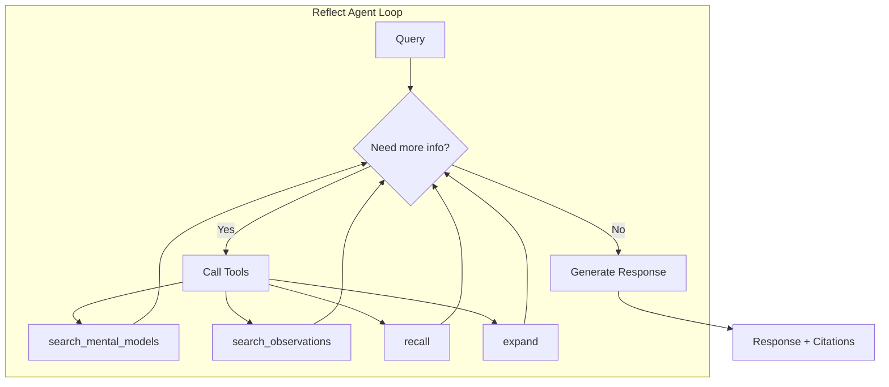

# Reflect: рассуждение агента с учётом черт поведения

При вызове `reflect()` Hindsight запускает **цикл агента**: сам собирает доказательства и рассуждает с учётом черт банка, чтобы дать ответ по контексту.



---

## Как это работает

В отличие от простого поиска, reflect:

1. **Сам собирает доказательства** — агент решает, какие сведения нужны, и вызывает подходящие инструменты.
2. **Ищет по уровням** — сперва ментальные модели, затем наблюдения, затем исходные факты.
3. **Учитывает черты поведения** — подстраивает рассуждение под характер банка.
4. **Соблюдает указания** — жёсткие правила для всех ответов.
5. **Ссылается на источники** — возвращает список взятых воспоминаний и наблюдений.

### Цикл агента

Агент reflect работает в цикле и может вызывать такие инструменты:

| Инструмент | Для чего | Приоритет |
|------|---------|----------|
| `search_mental_models` | Созданные пользователем сводки | Самый высокий (проверить сперва) |
| `search_observations` | Обобщённые знания | Высокий |
| `recall` | Исходные факты для проверки | Запасной вариант |
| `expand` | Дополняет контекст воспоминания | По нужде |
| `done` | Завершает работу с готовым ответом | Когда ответ готов |

Агент:
- **Обязан собрать доказательства** до ответа: правило не даёт ответить без оснований.
- **Делает до 10 шагов** поиска нужных данных.
- **Проверяет ссылки**: разрешены лишь ID, которые он нашёл.

### Поиск по уровням

Агент применяет такой порядок:

1. **[Ментальные модели](api/mental-models.md)** — сводки для частых вопросов, заранее созданные пользователем.
2. **[Наблюдения](observations.md)** — обобщённые знания с учётом свежести.
3. **Исходные факты** — источник для проверки, если наблюдения устарели.

**Ментальные модели** — сохранённые ответы reflect на частые вопросы, которые вы создаёте сами. Агент проверяет их сперва, потому что эти знания были выбраны и проверены явно. Как их создавать и менять, описано в [API ментальных моделей](api/mental-models.md).

Если наблюдение помечено как **устаревшее**, агент сам сверяет его с новыми фактами.

---

## Зачем нужен Reflect?

Многие ИИ-системы умеют искать факты, но не умеют **рассуждать** о них одним и тем же способом.

### Проблема

Без reflect:
- **Нет устойчивого характера**: на один вопрос каждый раз приходит другой ответ.
- **Нет обобщения знаний**: система не связывает близкие факты.
- **Нет контекста для вывода**: ответ не учитывает накопленные знания.
- **Общие ответы**: все ИИ звучат одинаково.

### Польза

С reflect:
- **Устойчивый характер**: банк с вниманием к деталям и осторожным подходом делает упор на риски и тщательный план.
- **Развитие знаний**: наблюдения крепнут и меняются при поступлении новых доказательств.
- **Вывод по контексту**: «Судя по тому, как ваша команда наладила удалённую работу…».
- **Разный стиль**: помощник поддержки говорит мягко, а проверяющий код — прямо.

### Когда брать Reflect

| Берите `recall()`, если… | Берите `reflect()`, если… |
|------------------------|-------------------------|
| Нужны исходные факты | Нужно осмысленное толкование |
| Вы строите свой алгоритм рассуждения | Нужен ответ в стиле черт банка |
| Нужен полный контроль | Банк должен «думать» сам |
| Нужен простой поиск факта | Нужен совет |

**Пример:**
- `recall("Alice")` → возвращает все факты об Алисе и подходящие ментальные модели.
- `reflect("Should we hire Alice?")` → агент собирает сведения об Алисе, оценивает её пригодность и отвечает со ссылками.

---

## Черты поведения

При создании банка можно задать три черты. Они влияют на то, как банк толкует сведения и рассуждает при `reflect()`:

| Черта | Шкала | Низкое значение (1) | Высокое значение (5) |
|-------|-------|---------|----------|
| **Скептицизм** | 1–5 | Доверяет полученным сведениям | Сомневается и проверяет утверждения |
| **Буквальность** | 1–5 | Свободно толкует, читает между строк | Строго следует словам |
| **Эмпатия** | 1–5 | Отстранённо держится фактов | Учитывает чувства и эмоциональный контекст |

### Задача: описание роли словами

Кроме чисел можно задать **задачу** обычным языком: описать роль банка и контекст его рассуждений.

```python
client.create_bank(bank_id="architect-bank")
client.update_bank_config(
    "architect-bank",
    reflect_mission="You're a senior software architect - keep track of system designs, "
            "technology decisions, and architectural patterns. Prefer simplicity over cutting-edge.",
    disposition_skepticism=4,   # Questions new technologies
    disposition_literalism=4,   # Focuses on concrete specs
    disposition_empathy=2,      # Prioritizes technical facts
)
```

Задача reflect влияет на ход рассуждения и ответ:
- Даёт контекст роли: кто агент и что для него важно.
- Помогает применить черты поведения на деле.
- Делает выводы в разных беседах более ровными.

> **ℹ️ Задачи для разных операций**
> 
Задача reflect влияет лишь на `reflect()`. Чтобы направить извлечение в `retain()`, берите [`retain_mission`](api/memory-banks.md#retain-configuration). Чтобы управлять тем, что попадает в наблюдения, берите [`observations_mission`](api/memory-banks.md#observations-configuration).
---

## Как черты влияют на рассуждение

Два банка с разными чертами получили одни и те же факты об удалённой работе:

**Банк A** (мало скептицизма, много эмпатии):
> «Удалённая работа даёт гибкость и помогает сочетать работу с жизнью. Похоже, команда счастливее и работает лучше, когда может сама выбрать место».

**Банк B** (много скептицизма, мало эмпатии):
> «Утверждения о пользе удалённой работы нужно проверить. Каковы точные показатели труда? Личные впечатления могут не подтвердиться числами».

**Те же факты → разные выводы**, потому что черты меняют трактовку.

---

## Примеры черт для разных задач

Разным задачам подходят разные черты:

| Задача | Черты | Почему |
|----------|-------------------|-----|
| **Поддержка клиентов** | skepticism: 2, literalism: 2, empathy: 5 | Доверие, гибкость, понимание |
| **Проверка кода** | skepticism: 4, literalism: 5, empathy: 2 | Проверка допущений, точность, прямота |
| **Разбор правовых вопросов** | skepticism: 5, literalism: 5, empathy: 2 | Сильный скептицизм, точное чтение |
| **Психолог или наставник** | skepticism: 2, literalism: 2, empathy: 5 | Поддержка, чтение между строк |
| **Помощник для исследований** | skepticism: 4, literalism: 3, empathy: 3 | Проверка утверждений, взвешенное толкование |

---

## Указания: строгие правила

Черты поведения *влияют* на стиль, а **указания** задают правила, которым агент *обязан* следовать. Указания добавляются к запросу и действуют на каждый ответ.

### Когда задавать указания

Берите их для запретов и требований, которые нельзя нарушать:

- **Правила соблюдения норм**: «Никогда не советуй отдельные акции или финансовые продукты».
- **Защита личных данных**: «Никогда не передавай личные данные третьим лицам».
- **Требования к стилю**: «Всегда отвечай на строгом английском языке».
- **Правила по теме**: «Для каждого утверждения о фактах приводи источник».

### Указания и черты поведения

| Свойство | Черты поведения | Указания |
|--------|-------------|------------|
| **Сила** | Мягкое влияние | Строгое правило |
| **Эффект** | Меняют толкование и тон | Нужно следовать точно |
| **Нарушение** | Допустимо: это лишь склонность | Недопустимо |
| **Пример** | Сильный скептицизм → проверяет утверждения | «Никогда не ставь медицинский диагноз» |

> **💡 Совет**
> 
Черты задают характер. Указания задают строгие границы.
Как создавать указания и управлять ими, см. в разделе [«Банки памяти — указания»](api/memory-banks.md#directives).

---

## Что возвращает Reflect

Вызов `reflect()` возвращает:

- **Текст ответа** — ответ агента с учётом черт поведения.
- **based_on** — основания ответа: воспоминания, ментальные модели и указания.
- **trace** — вызовы инструментов, LLM и взятые наблюдения (если `include.tool_calls=True`).
- **structured_output** — разобранный ответ, если задано `response_schema`.
- **usage** — сведения о числе токенов.

**Пример:**
```json
{
  "text": "Based on Alice's ML expertise and her work at Google, she'd be an excellent fit for the research team lead position...",
  "based_on": {
    "memories": [
      {"id": "mem-123", "text": "Alice has 5 years of ML experience", "type": "world"},
      {"id": "mem-456", "text": "Alice worked at Google on search ranking", "type": "experience"}
    ],
    "mental_models": [],
    "directives": [
      {"id": "dir-001", "name": "Formal Language", "rules": ["Always respond in formal English"]}
    ]
  },
  "usage": {"input_tokens": 1500, "output_tokens": 500, "total_tokens": 2000}
}
```

Агент сам собирает доказательства, проверяет ссылки и создаёт ответ с ясным основанием.

---

## Почему черты важны

Без заданных черт все ИИ-помощники звучат одинаково. С ними:

- **Помощник поддержки** может быть тактичным и чутким.
- **Помощник по проверке кода** может говорить прямо и подробно.
- **Творческий помощник** может быть открыт необычным идеям.
- **Аналитик рисков** может проявлять нужную осторожность.

Черты дают **постоянный характер** в разных беседах, а наблюдения **меняются по мере появления новых фактов**.

---

## Что дальше

- [**Наблюдения**](./observations) — как обобщаются знания
- [**Retain**](./retain) — как хранятся полные факты
- [**Recall**](./retrieval) — как работает поиск несколькими способами
- [**API Reflect**](./api/reflect) — примеры кода и параметры
