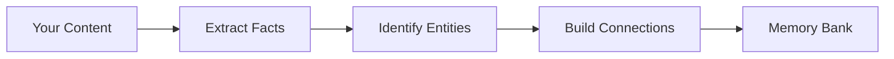

# Retain: как Hindsight хранит воспоминания

При вызове `retain()` Hindsight превращает беседы и документы в структурные воспоминания, по которым можно искать. Смысл и контекст при этом сохраняются.

## Что делает Retain



---

## Извлечение полных фактов

Hindsight хранит не только то, *что* сказано, но и **почему**, **как** и **что это значит**.

### Какие сведения извлекаются

Из фразы «Алиса пришла в Google прошлой весной и была рада новой работе над исследованиями» Hindsight извлечёт:

**Основные факты:**
- Алиса пришла в Google.
- Это было прошлой весной.

**Чувства и смысл:**
- Она была рада.
- Это была важная для неё возможность.

**Причину:**
- Она выбрала работу из-за возможности вести исследования.

Благодаря этому на вопрос «Почему Алиса пришла в Google?» можно дать осмысленный ответ, а не только повторить, что она туда пришла.

### Сохранение контекста

Обычные системы дробят сведения:
- «Боб предложил Summer Vibes».
- «Алиса хотела что-то необычное».
- «Они выбрали Beach Beats».

Hindsight сохраняет всю историю:
- «Алиса и Боб выбирали имя для плейлиста летней вечеринки. Боб предложил „Summer Vibes“: оно легко запоминается. Алиса хотела что-то необычное. В итоге они выбрали „Beach Beats“ за игривый тон».

Поэтому поиск возвращает полный контекст, а не разрозненные куски.

---

## Два вида фактов

Вид каждого факта зависит от **точки зрения**: агента — владельца банка или внешнего мира.

| Вид | Что описывает | Пример |
|----------------|------------------------------------------------------------------------------|---------|
| **experience** | Действия, наблюдения и беседы самого агента банка — его личную историю | «Я посоветовал Алисе Python» |
| **world** | Других людей, места, вещи и события | «Алиса работает в Google» |

Решает **кто говорит**, а не грамматика. Фраза от первого лица относится к `experience` лишь тогда, когда её говорит *агент банка*. Те же слова другого человека становятся фактом `world` об этом человеке:

- Личный журнал агента — «Я исправил ошибку входа» → **experience** (это сделал агент).
- Пользователь говорит агенту — «Я купил Tesla» → **world** (факт о *пользователе*, а не об агенте).

Помочь верной разметке можно двумя способами:

- **Задайте понятное имя банка `name`** (имя агента). Так система знает, кто здесь «агент». Если поле не задано, берётся `bank_id`. Но если `bank_id` — лишь ключ для маршрута, например `my-agent::channel-456::user-789`, он не годится как имя говорящего. Дайте банку настоящее имя.
- **Укажите говорящего в `context` каждого элемента**, если сохраняете запись беседы или чужой текст. Например, контекст *«Говорит клиент Мария»* поможет отнести её слова от первого лица к фактам `world` о Марии, а не к опыту агента. Если `context` и имя банка расходятся, `context` имеет приоритет.

**Примечание:** после завершения `retain()` наблюдения сами обобщаются в фоне. Система находит закономерности в новых фактах и добавляет их в знания банка.

---

## Распознавание сущностей

Hindsight сам находит и отслеживает **сущности**: важных людей, организации и понятия.

### Что он распознаёт

- **Людей:** «Алиса», «доктор Смит», «Боб Чен».
- **Организации:** «Google», «MIT», «OpenAI».
- **Места:** «Париж», «Центральный парк», «Калифорния».
- **Продукты и понятия:** «Python», «TensorFlow», «машинное обучение».

### Сопоставление сущностей

Разные имена одной сущности соединяются:
- «Алиса» + «Алиса Чен» + «Алиса Ч.» → один человек.
- «Боб» + «Роберт Чен» → один человек (учитываются краткие имена).

**Зачем это нужно:** на вопрос «Что я знаю об Алисе?» вы получите все сведения, даже если в части бесед её звали «Алиса Чен».

### Различение по контексту

Если «Алиса» несколько раз встречалась рядом с «Google» и «Stanford», то новое упоминание Алисы с этими названиями, скорее всего, относится к тому же человеку. Hindsight различает частые имена по совместным упоминаниям.

### Метки сущностей

Вы можете задать строгий набор меток `key:value` (например, `pedagogy:scaffolding`, `engagement:active`). Они извлекаются при retain и хранятся как сущности. Поэтому метки сами связывают воспоминания в графе знаний и помогают поиску по смыслу и словам. По желанию метки можно также записывать в теги единиц памяти, чтобы при recall и reflect работать с обычным фильтром тегов.

Полная настройка описана в разделе [`entity_labels` в настройках банка](api/memory-banks.md#entity-labels).

---

## Построение связей

Воспоминания не изолированы: Hindsight строит **граф знаний** с четырьмя видами связей.

### Связи по сущностям

Все факты об одной сущности связываются.

**Это даёт:** запрос «Расскажи всё об Алисе» находит все связанные с ней факты.

### Связи по времени

Близкие по времени факты связываются; чем ближе даты, тем сильнее связь.

**Это даёт:** запрос «Что ещё случилось примерно тогда?» находит события вокруг того же времени.

### Связи по смыслу

Факты с близким смыслом связываются, даже если записаны разными словами.

**Это даёт:** запрос «Расскажи о похожих темах» находит близкие по теме сведения.

### Причинные связи

Причины и следствия отмечаются явно.

**Это даёт:** запрос «Почему это произошло?» позволяет пройти по цепи причин.
**Пример:** «Алиса устала от работы» ← причина ← «Она работала по 80 часов в неделю».

---

## Учёт времени

Hindsight следит за **двумя измерениями времени**.

### Когда это произошло

Для событий (встреч, поездок, важных вех) Hindsight хранит время события.
- «Алиса вышла замуж в июне 2024 года» → событие было в июне 2024 года.

У общих фактов (предпочтений, черт) нет точного момента события.
- «Алиса предпочитает Python» → предпочтение действует сейчас.

### Когда об этом узнали

Hindsight также хранит время, когда ему сообщили факт.

**Зачем нужны обе даты?**

Представьте: в январе 2025 года кто-то сказал «Алиса вышла замуж в июне 2024 года».
- **Поиск по прошлому**: «Что случилось с Алисой в 2024 году?» → найдёт свадьбу.
- **Учёт свежести**: недавние упоминания получают приоритет в поиске.
- **Вывод по времени**: «Что было до её свадьбы?» → найдёт более ранние события.

Без такого различия старые сведения нельзя было бы найти по дате или они казались бы неважными.

---

## Теги воспоминаний

Теги задают область видимости. Это полезно, если один банк обслуживает нескольких пользователей, но каждый должен видеть лишь свои данные.

- **Теги элемента**: задают область видимости отдельных воспоминаний.
- **Теги документа**: действуют на все элементы пакета.
- **Фильтр тегов**: отбирает записи при recall/reflect.

Примеры кода — в разделе [«API Retain»](./api/retain), а настройки отбора — в [«API Recall»](./api/recall).

---

## Что получится

После завершения `retain()` вы получите:

- **Структурные факты**, которые хранят смысл, чувства и причины.
- **Объединённые сущности** с разными вариантами имён.
- **Граф знаний** со связями по сущностям, времени, смыслу и причинам.
- **Привязку ко времени** для поиска по прошлому и свежести данных.
- **Теги по желанию** для отбора при recall.

Всё хранится в отдельном **банке памяти** и готово к `recall()` и `reflect()`.

---

## Как направить извлечение с помощью задачи

По умолчанию `retain()` извлекает из текста все значимые факты. Сузить выбор поможет **задача для retain** (`retain_mission`) — описание того, что важно для банка.

```
e.g. Always include technical decisions, API design choices, and architectural trade-offs.
     Ignore meeting logistics, greetings, and social exchanges.
```

Задача добавляется к запросу на извлечение вместе со встроенными правилами. Она направляет LLM, но не заменяет основной алгоритм. Она работает с любым режимом извлечения (`concise`, `verbose`, `custom`).

Для более точного управления можно также сменить **режим извлечения**:

| Режим | Когда брать |
|------|-------------|
| `concise` *(по умолчанию)* | Для общих задач: выборочное и быстрое извлечение |
| `verbose` | Когда нужны более полные факты с контекстом и связями |
| `custom` | Когда вы хотите сами написать все правила извлечения |

Задайте `retain_mission` и `retain_extraction_mode` через [API настройки банка](api/memory-banks.md#retain-configuration) или переменную среды [`HINDSIGHT_API_RETAIN_MISSION`](configuration.md#retain).

---

## Обобщение наблюдений

После завершения `retain()` Hindsight сам запускает **обобщение наблюдений** в фоне. Оно:

1. Сверяет новые факты с текущими наблюдениями.
2. Создаёт новые наблюдения, если видна закономерность.
3. Уточняет прежние наблюдения по новым данным.
4. Хранит связь каждого наблюдения с поддерживающими его фактами.

Процесс асинхронный: вызов `retain()` возвращается сразу, а обобщение продолжается в фоне.

Подробности — в разделе [«Наблюдения»](./observations).

---

## Защита памяти и происхождение данных

### receipt_uri (по желанию)

Тип: `string`.

Ссылка на внешнюю квитанцию или службу совместной подписи. Хранится без правок и показывается как `security_events.receipt_uri` для любого решения Memory Defense по этому элементу.

### 422 — нарушение правила защиты памяти

Если в нужном банке включена Memory Defense и правило блокирует **каждый** элемент пакета, запрос вернёт 422 со списком нарушений:

```json
{
  "detail": {
    "violations": [
      { "index": 0, "detector": "prompt_injection", "severity": "high", "message": "..." }
    ]
  }
}
```

Если заблокирована лишь часть пакета, запрос вернёт 200 и обработает оставшиеся элементы. Заблокированные элементы тихо исключаются из результата, а решения по ним пишутся в `security_events`.

Полное руководство — в разделе [«Защита памяти»](./memory-defense/index.md).

---

## Что дальше

- [**Наблюдения**](./observations) — как знания обобщаются после retain
- [**Recall**](./retrieval) — как поиск несколькими способами находит нужные воспоминания
- [**Reflect**](./reflect) — как агент применяет наблюдения в ходе рассуждения
- [**API Retain**](./api/retain) — примеры кода и параметры
