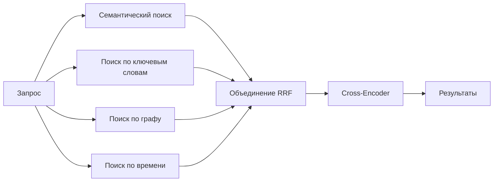

# Recall: как Hindsight извлекает воспоминания

При вызове `recall()` Hindsight параллельно применяет несколько способов поиска, чтобы найти наиболее подходящие воспоминания независимо от формулировки запроса.



---

## Сложность поиска воспоминаний

Для разных запросов нужны разные способы поиска:

- **«Элис работает в Google»** — нужно найти точное совпадение имени.
- **«Где работает Элис?»** — нужно понять смысл запроса.
- **«Чем Элис занималась прошлой весной?»** — нужно рассуждение о времени.
- **«Почему Элис ушла?»** — нужно проследить причинно-следственную связь.

Ни один способ поиска не решает все эти задачи одинаково хорошо. Hindsight использует **TEMPR** — четыре дополняющих друг друга стратегии, работающих параллельно.

## Четыре стратегии поиска

### Семантический поиск

**Что делает:** учитывает *смысл* слов, а не только их точное совпадение.

**Лучше всего подходит для:**

- совпадения понятий: «работа Элис» → «Элис работает инженером-программистом»;
- перефразирования: «опыт Боба» → «Боб специализируется на машинном обучении»;
- синонимов: «встреча» соответствует словам «совещание», «обсуждение», «собрание».

**Почему это важно:** можно задавать вопросы обычным языком без точного совпадения ключевых слов.

### Поиск по ключевым словам

**Что делает:** находит точные термины и имена, в том числе уникальные.

**Лучше всего подходит для:**

- имён собственных: «Google», «Элис Чен», «MIT»;
- технических терминов: «PostgreSQL», «HNSW», «TensorFlow»;
- уникальных идентификаторов: URL, названий продуктов и точных фраз.

**Почему это важно:** поиск не упустит результаты с конкретными именами и терминами, даже если по смыслу они далеки от запроса.

**Механизмы поиска:** Hindsight поддерживает пять сменных механизмов BM25, выбираемых параметром `HINDSIGHT_API_TEXT_SEARCH_EXTENSION`:

| Механизм | Используемая технология | Совместим с Citus? |
|----------|-------------------------|--------------------|
| `native` | `tsvector` и `ts_rank_cd` PostgreSQL (TF-IDF, а не настоящий BM25) | Да |
| `vchord` | Расширение `vchord_bm25` | Нет |
| `pg_textsearch` | Расширение Timescale `pg_textsearch` | Нет |
| `pgroonga` | Полнотекстовое расширение PGroonga (Groonga), многописьменный токенизатор `TokenBigram` | Нет |
| `pg_search` | Расширение ParadeDB `pg_search`, настраиваемый токенизатор (например, `jieba`, `chinese_compatible`, `ngram`) через `HINDSIGHT_API_TEXT_SEARCH_EXTENSION_PG_SEARCH_TOKENIZER` | Да |

Если нужен настоящий рейтинг BM25 в горизонтально масштабируемом кластере PostgreSQL (Citus), доступен только `pg_search`. См. [пример docker-compose для `pg_search`](https://github.com/vectorize-io/hindsight/tree/main/docker/docker-compose/pg_search).

### Обход графа

**Что делает:** проходит по связям между сущностями и находит косвенно связанные сведения.

**Лучше всего подходит для:**

- косвенных связей: «Чем занимается Элис?» → Элис → Google → продукты Google;
- поиска связей сущности: «Коллеги Боба» → Боб → коллеги → общие проекты;
- многошаговых рассуждений: «Достижения команды Элис».

**Почему это важно:** извлекаются факты, не похожие на запрос ни по смыслу, ни по словам, но **связанные структурно** через граф знаний.

**Пример:** даже если Элис и её руководитель никогда не упоминались вместе, обход графа может найти руководителя через общие проекты или связи в команде.

### Поиск по времени

**Что делает:** распознаёт выражения времени и фильтрует воспоминания по датам событий.

**Лучше всего подходит для:**

- запросов об истории: «Чем Элис занималась в 2023 году?»;
- периодов: «Что происходило прошлой весной?»;
- относительного времени: «Над чем Боб работал в прошлом году?»;
- последовательности событий: «Что произошло до того, как Элис устроилась в Google?».

**Как работает:** если запрос содержит указание времени, Hindsight преобразует его в диапазон дат и извлекает воспоминания, даты которых попадают в этот период. Кандидаты внутри периода отбираются по **семантической релевантности запросу**, а не по давности. Поэтому наиболее подходящее воспоминание в пределах периода не исключается только потому, что другие записи новее. Затем выбранные воспоминания **равномерно распределяются по периоду**: он делится на временные интервалы, из каждого заполненного интервала сначала выбирается лучшее совпадение. Поэтому по запросу «Что произошло в 2023 году?» выдаются сведения за весь год, а не только из наиболее плотной части. Время также влияет на *оценку*: воспоминания ближе к центру периода получают небольшой бонус (см. [близость ко времени запроса](#сигнал-близости-ко-времени)).

**Почему это важно:** можно точно и полно искать сведения об истории. Метод остаётся быстрым и полезным, даже если временные отметки в банке сгруппированы (например, большая партия добавлена с одной датой): поскольку сначала учитывается релевантность, запрос по периоду, совпадающему с большей частью банка, вернёт лучшие совпадения, а не случайную выборку.

---

## Объединение результатов

После завершения всех четырёх стратегий результаты **объединяются**:

- Воспоминания, найденные **несколькими стратегиями**, занимают более высокие позиции: разные способы поиска подтвердили совпадение.
- **Позиция важнее оценки**: это надёжнее при сочетании разных систем оценивания.
- Итоговые результаты повторно **ранжируются** нейронной моделью, которая оценивает взаимодействие запроса и воспоминания.

**Зачем нужно объединение:** факт, который одновременно близок по смыслу и упоминает нужную сущность, будет выше факта, похожего только по смыслу.

## Зачем использовать несколько стратегий?

Рассмотрим запрос: **«Что Элис говорила о Python прошлой весной?»**

- **Семантический поиск** находит факты о взглядах Элис на программирование.
- **Поиск по ключевым словам** проверяет, что там действительно упоминается «Python».
- **Поиск по графу** связывает Элис → языки программирования → связанные сущности.
- **Поиск по времени** ограничивает результаты прошлой весной.

**Совместная выдача** четырёх стратегий находит нужное, хотя каждой отдельной стратегии недостаточно.

---

## Управление лимитом токенов

Hindsight предназначен для ИИ-агентов, а не для людей. Обычные поисковые системы возвращают верхние *k* результатов, но агенты оперируют не числом результатов, а токенами. Контекстное окно агента измеряется токенами — так же Hindsight измеряет выдачу.

**Как это работает:**

- Сначала выбираются воспоминания с наивысшим рейтингом.
- Поиск прекращается, когда исчерпан лимит токенов.
- Вы задаёте размер контекста, а Hindsight заполняет его наиболее подходящими воспоминаниями.

**Параметры:**

- `max_tokens` — максимальный объём возвращаемого содержимого памяти (по умолчанию 4096 токенов).
- `budget` — уровень глубины поиска (`low`, `mid`, `high`).
- `types` — фильтр по типу: world, experience, observation или все.
- `tags` — фильтр воспоминаний по меткам видимости.
- `tags_match` — способ сопоставления меток; полный список см. в [API Recall](./api/recall).

### Расширение контекста: фрагменты

Воспоминания — кратко сформулированные факты, в которых иногда не хватает нюансов. Если агенту нужен дополнительный контекст, можно извлечь исходный текст:

**Фрагменты** содержат сырой текст, из которого созданы воспоминания. Они полезны, если в кратком факте потеряны важные детали:

```
Воспоминание: «Элис предпочитает Python языку JavaScript»
Фрагмент:     «Элис сказала, что предпочитает Python главным образом
               из-за возможностей для науки о данных. При этом она
               признаёт, что JavaScript лучше для фронтенда, и недавно
               начала изучать TypeScript».
```

Передайте `include_chunks=True` и задайте лимит фрагментов через `max_chunk_tokens`. Это полезно для ответов с дословными цитатами или при важном контексте, например: «Что именно Элис сказала о проекте?».

---

## Настройка Recall: качество и задержка

Для разных задач нужен разный баланс между **качеством извлечения** и **скоростью ответа**. Его задают два параметра.

### Budget: глубина поиска

Определяет, насколько тщательно Hindsight изучает банк памяти: влияет на глубину обхода графа, размер набора кандидатов и повторное ранжирование cross-encoder.

| Budget | Подходит для | Компромисс |
|--------|--------------|------------|
| **low** | Быстрый поиск, простые запросы | Быстро, но можно пропустить косвенные связи |
| **mid** | Большинство запросов, сбалансированный режим | Хороший охват при разумной скорости |
| **high** | Сложные запросы, требующие глубокого поиска | Тщательно, но медленнее |

**Пример:** для запроса «Над чем работала команда руководителя Элис?» полезен высокий budget: нужно пройти цепочку Элис → руководитель → команда → проекты и оценить больше кандидатов.

### Max Tokens: размер контекстного окна

Определяет, какой объём содержимого памяти вернуть:

| Max Tokens | Примерно страниц текста | Подходит для | Компромисс |
|------------|-------------------------|--------------|------------|
| **2048** | 2 страницы | Целевые ответы и быстрый LLM | Меньше воспоминаний, быстрее |
| **4096** (по умолчанию) | 4 страницы | Сбалансированный контекст | Хороший охват, стандартная скорость |
| **8192** | 8 страниц | Подробный контекст | Больше воспоминаний, медленнее LLM |

**Пример:** для запроса «Обобщи всё, что известно об Элис» лучше задать больше `max_tokens`, чтобы включить больше фактов.

### Два независимых параметра

`budget` и `max_tokens` управляют разными аспектами Recall:

| Параметр | За что отвечает | Влияние на задержку | Пример |
|----------|----------------|---------------------|--------|
| **Budget** | Насколько глубоко изучать память | Время поиска | Высокий budget найдёт Элис → руководителя → команду → проекты |
| **Max Tokens** | Сколько контекста вернуть | Время обработки LLM | Больший лимит возвращает агенту больше воспоминаний |

**Параметры независимы.** Примеры сочетаний:

| Budget | Max Tokens | Сценарий |
|--------|------------|----------|
| high | low | Глубокий поиск, вернуть только лучшие результаты |
| low | high | Быстрый поиск, вернуть всё найденное |
| high | high | Подробное исследование |
| low | low | Быстрые ответы чат-бота |

### Рекомендуемые настройки

| Сценарий | Budget | Max Tokens | Причина |
|----------|--------|------------|---------|
| **Ответы чат-бота** | low | 2048 | Быстрые ответы, ограниченный контекст |
| **Вопросы по документам** | mid | 4096 | Баланс охвата и скорости |
| **Исследовательские запросы** | high | 8192 | Подробный поиск и многошаговые рассуждения |
| **Поиск в реальном времени** | low | 2048 | Минимальная задержка |

---

## Подробно о подсчёте баллов и ранжировании

В этом разделе описано, как Hindsight преобразует исходные результаты поиска в итоговый список по рейтингу. Обработка состоит из трёх этапов: **объединение RRF**, **повторное ранжирование cross-encoder** и **совместное оценивание**.

### Этап 1: Reciprocal Rank Fusion (RRF)

После параллельного выполнения всех стратегий их результаты объединяются с помощью [Reciprocal Rank Fusion](https://plg.uwaterloo.ca/~gvcormac/cormacksigir09-rrf.pdf). RRF повышает рейтинг элементов, которые занимают высокие позиции в нескольких стратегиях. Исходные баллы не используются, поскольку шкалы разных методов поиска несопоставимы.

**Формула:**

```
score(d) = Σ  1 / (k + rank_i(d))
           i
```

Где:

- **k = 60** — коэффициент сглаживания, который не даёт первым результатам чрезмерно доминировать.
- **rank_i(d)** — позиция документа *d* в стратегии *i*, нумерация начинается с 1.
- Суммируются стратегии, в которых найден *d*.

**Все четыре стратегии имеют одинаковый вес в RRF.** Слияние учитывает позиции, а не источник, поэтому ни одна стратегия автоматически не получает дополнительный коэффициент. При этом источник можно намеренно усилить настройкой [`HINDSIGHT_API_RECALL_STRATEGY_BOOSTS`](./configuration). Она применяется отдельно — до ограничения кандидатов перед ранжированием и ещё раз после него, а не внутри описанного выше слияния RRF.

**Почему RRF, а не прямое объединение баллов?** Каждая стратегия выдаёт баллы по своей шкале: косинусное сходство, BM25 TF-IDF, активация графа. Они несопоставимы: балл BM25 12,5 и косинусное сходство 0,85 не означают одно и то же. RRF использует только позиции и устойчиво работает с любыми шкалами без калибровки.

**Пример:** воспоминание занимает 1-е место в семантическом поиске и 5-е по BM25:

```
Балл RRF = 1/(60+1) + 1/(60+5) = 0.0164 + 0.0154 = 0.0318
```

Воспоминание, найденное только семантическим поиском и занявшее 1-е место:

```
Баллы RRF = 1/(60+1) = 0.0164
```

Первое воспоминание занимает более высокое место, потому что стратегии **согласны** между собой.

### Этап 2: повторное ранжирование Cross-Encoder

RRF задаёт хорошее исходное ранжирование, но оно основано на позициях, а не на глубоком понимании запроса и документа. Cross-encoder оценивает каждую пару «запрос — кандидат» и выставляет балл релевантности.

**Предварительный отбор:** до повторного ранжирования остаются 300 лучших кандидатов по баллу RRF, чтобы ограничить вычислительные затраты. Лимит задаётся параметром `HINDSIGHT_API_RERANKER_MAX_CANDIDATES`. Если указан [`HINDSIGHT_API_RECALL_STRATEGY_BOOSTS`](./configuration), усиление применяется к баллам RRF до отсечения, поэтому у кандидатов из предпочтительного источника больше шансов сохраниться.

**Зачем повторно ранжировать после RRF?** RRF учитывает позиции: он знает, что воспоминание хорошо ранжировалось в разных стратегиях, но не сопоставляет его с запросом напрямую. Cross-encoder получает запрос и каждого кандидата как пару и выставляет оценку с учётом их взаимодействия. Так выявляются нюансы, пропущенные слиянием, например когда воспоминание заняло первое место по ключевым словам из-за распространённого термина, но не отвечает намерению пользователя.

**Нормализация баллов:** cross-encoder возвращает исходные логиты, в том числе отрицательные. Баллы уже в диапазоне [0, 1], возвращаемые откалиброванными внешними сервисами ранжирования (например, Cohere, SiliconFlow, ZeroEntropy, Alibaba и Jina), остаются без изменений: так сохраняется их абсолютная уверенность. Исходные логиты за пределами [0, 1] нормализуются функцией сигмоиды:

```
CE_normalized = 1 / (1 + e^(-raw_logit))
```

**Пакетная обработка:** кандидаты оцениваются пакетами по **32 пары** локальным ранжировщиком или по **128 пар** для TEI.

:::tip Если Cross-Encoder не используется
Если Cross-Encoder недоступен (например, в облегчённом образе без внешнего ранжировщика), система использует баллы на основе RRF: кандидатам назначаются условные баллы от [0.1, 1.0] в соответствии с рейтингом RRF. Благодаря этому последующие коэффициенты совместного оценивания всё ещё работают корректно.
:::

### Этап 3: совместное оценивание и коэффициенты

Нормализованный балл Cross-Encoder корректируется тремя **мультипликативными коэффициентами**, которые учитывают сигналы, недоступные самому ранжировщику: давность, близость к нужному периоду и вес доказательств.

**Почему коэффициенты перемножаются, а не складываются?** При сложении (например, `CE + 0.1 × recency`) каждый кандидат получит одинаковую абсолютную надбавку независимо от релевантности. Почти не относящееся к теме недавнее воспоминание может обогнать очень подходящее только потому, что оно новее. При умножении поправка пропорциональна исходной релевантности: увеличение на 10% сильнее меняет высокий балл, чем низкий. Поэтому вторичные сигналы не перевешивают основную оценку релевантности.

**Формула:**

```
final_score = CE_normalized × recency_boost × temporal_boost × proof_count_boost
```

Каждый коэффициент нейтрален при значении 1.0; величина изменения ограничивается параметром alpha:

```
boost = 1 + α × (signal - 0.5)
```

| Коэффициент | α | Максимальная поправка | Что повышает |
|-------------|---|----------------------|--------------|
| **Давность** | 0.2 | ±10% | Более новые воспоминания по сравнению со старыми |
| **Близость ко времени** | 0.2 | ±10% | Воспоминания рядом с запрошенным периодом |
| **Количество доказательств** | 0.1 | ±5% | Наблюдения с большим количеством подтверждений |

#### Сигнал давности

Линейно уменьшается в течение 365 дней от даты события:

```
recency = clamp(1.0 - days_ago / 365, 0.1, 1.0)
```

Воспоминание с датой запроса получает `recency = 1.0` (прибавка 10%). Воспоминание за полгода до даты запроса получает около `0.5` (без поправки). Запись старше года получает `0.1` (штраф 8%). Если `query_timestamp` не передан, используется текущее время сервера. Воспоминания без даты получают `0.5` — без прибавки или штрафа.

#### Сигнал близости ко времени

Используется только если запрос содержит ссылку на время, например «прошлой весной» или «в 2023 году». Измеряет, насколько дата воспоминания близка к центру запрошенного периода:

```
temporal_proximity = 1.0 - min(days_from_center / (window_days / 2), 1.0)
```

Воспоминание в центре периода получает `1.0` (прибавка 10%), а на границе — `0.0` (штраф 10%). Для запросов без времени все воспоминания получают `0.5` (без поправки).

#### Сигнал количества доказательств

Для воспоминаний типа observation повышает рейтинг записей, подкреплённых большим количеством свидетельств, по логарифмической шкале:

```
proof_norm = clamp(0.5 + ln(proof_count) / 10, 0.0, 1.0)
```

| Количество доказательств | proof_norm | Прибавка |
|-------------------------|------------|----------|
| 1 | 0.5 | Нет |
| 3 | 0.61 | +1.1% |
| 10 | 0.73 | +2.3% |
| 150 и более | 1.0 | +5% (максимум) |

#### Максимальный суммарный диапазон

Если все коэффициенты на предельных значениях:

- **Лучший случай:** ×1.10 × 1.10 × 1.05 ≈ **+27%**.
- **Худший случай:** ×0.90 × 0.90 × 0.95 ≈ **−23%**.

Коэффициенты намеренно ограничены: они помогают ранжированию, но не перевешивают релевантность, рассчитанную Cross-Encoder.

### Этап 4: ограничение токенов

После расчёта баллов результаты сортируются по `final_score`. Лучшие добавляются в ответ, пока не исчерпан лимит `max_tokens`. В лимит входят только тексты воспоминаний; метаданные не учитываются.

### Как Budget задаёт параметры обработки

Параметр `budget` (`low`, `mid`, `high`) управляет **глубиной поиска**, то есть количеством кандидатов, рассматриваемых каждой стратегией. Каждому уровню соответствует числовой лимит recall, который проходит через этапы обработки:

| Budget | Лимит recall (фиксированный режим) | Переменная среды для изменения |
|--------|------------------------------------|--------------------------------|
| **low** | 100 | `HINDSIGHT_API_RECALL_BUDGET_FIXED_LOW` |
| **mid** | 300 (по умолчанию) | `HINDSIGHT_API_RECALL_BUDGET_FIXED_MID` |
| **high** | 1000 | `HINDSIGHT_API_RECALL_BUDGET_FIXED_HIGH` |

Далее лимит применяется так:

| Этап обработки | Применение лимита recall |
|----------------|--------------------------|
| **Семантический поиск** | Запрашивает из HNSW `max(recall_budget × 5, 100)` кандидатов и сокращает список до `recall_budget`. |
| **Поиск BM25** | Параметр SQL `LIMIT recall_budget`. |
| **Обход графа** | Проверяет не более `recall_budget` узлов. |
| **Временное распределение** | Активирует по связям до `recall_budget` узлов. |
| **Рассмотрение результатов** | Перед фильтрацией по токенам рассматривает `recall_budget × 2` верхних результатов. |

Предварительное ограничение для повторного ранжирования (300 кандидатов) **не зависит** от budget. Это отдельная настройка: `HINDSIGHT_API_RERANKER_MAX_CANDIDATES`.

:::info Адаптивный лимит
В альтернативном режиме лимит recall зависит от `max_tokens`, а не использует фиксированные значения:

```
recall_budget = clamp(max_tokens × ratio, min, max)
```

| Budget | Коэффициент | Переменная среды для изменения |
|--------|-------------|--------------------------------|
| low | 2.5% от max_tokens | `HINDSIGHT_API_RECALL_BUDGET_ADAPTIVE_LOW` |
| mid | 7.5% от max_tokens | `HINDSIGHT_API_RECALL_BUDGET_ADAPTIVE_MID` |
| high | 25% от max_tokens | `HINDSIGHT_API_RECALL_BUDGET_ADAPTIVE_HIGH` |

Результат ограничен снизу значением **20** (`HINDSIGHT_API_RECALL_BUDGET_MIN`) и сверху значением **2000** (`HINDSIGHT_API_RECALL_BUDGET_MAX`).

Включите режим, задав `HINDSIGHT_API_RECALL_BUDGET_FUNCTION=adaptive`.
:::

### Подробности оценки графа

Обход графа (расширение по связям) складывает три независимых сигнала для каждого кандидата:

| Сигнал | Формула балла | Диапазон |
|--------|---------------|----------|
| **Пересечение сущностей** | `tanh(shared_entity_count × 0.5)` | [0, примерно 1.0] |
| **Семантическая связь** | Вес предварительно рассчитанной связи kNN | [0.7, 1.0] |
| **Причинная связь** | Вес причинной связи | [0, 1.0] |

```
graph_score = entity_score + semantic_score + causal_score   ∈ [0, 3]
```

Сложение вознаграждает **совпадение независимых свидетельств**: воспоминание, связанное с запросом несколькими видами сигналов, получает более высокий рейтинг, чем связанное только одним сильным сигналом.

**Зачем для сущностей использовать tanh?** Количество общих сущностей ничем не ограничено. Популярная сущность вроде «пользователь» может дать 50 и более совпадений и заглушить два других сигнала. `tanh(count × 0.5)` естественно насыщается: первые несколько общих сущностей важны (1 → 0.46, 2 → 0.76, 3 → 0.91), а следующие дают всё меньший прирост. Так сигнал сущностей остаётся в диапазоне [0, 1], как семантические и причинные оценки.

**Почему здесь используется сложение, а не умножение?** В отличие от поправок совместного оценивания, сигналы графа — независимые свидетельства, а не поправки к базовому баллу. Воспоминание может быть связано только причинной связью, без общих сущностей и семантического сходства. При умножении оно получило бы ноль. Сложение позволяет каждому сигналу учитываться отдельно; итоговый рейтинг между стратегиями формирует внешнее объединение RRF.

**Пример сигнала сущностей:** если у воспоминания с запросом одна общая сущность, оценка равна `tanh(0.5) ≈ 0.46`; две дают `tanh(1.0) ≈ 0.76`; при трёх и более значение приближается к 0.91 и выше.

---

## Дальше

- [**Retain**](./retain) — как сохраняются воспоминания с подробным контекстом.
- [**Reflect**](./reflect) — как disposition влияет на рассуждения.
- [**API Recall**](./api/recall) — примеры кода, параметры и фильтрация по меткам.
